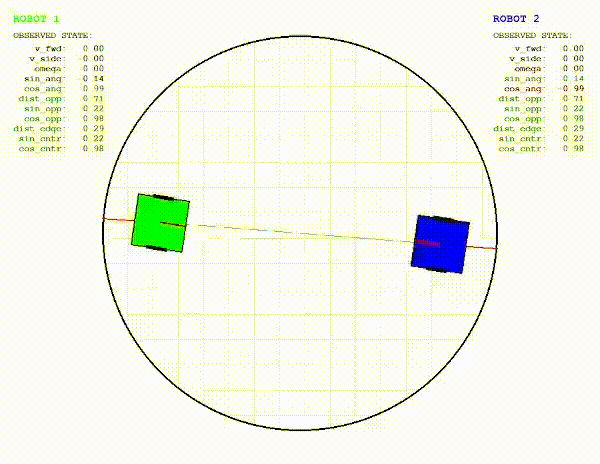
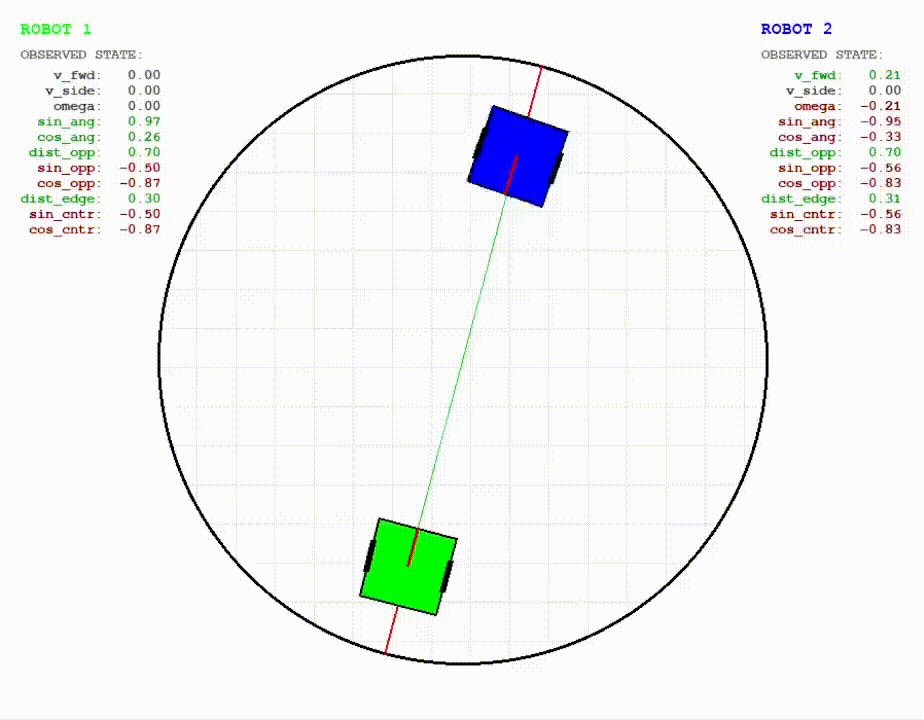

# Mini-Sumo RL Training System

This project implements an autonomous Mini-Sumo combat agent trained using Reinforcement Learning (Actor-Critic architecture). The system utilizes a parallelized training environment featuring a self-play mechanism, where the learning agent competes against a "Master" model or its own historical versions to continuously evolve and refine its combat strategies. Key features include a sophisticated reward shaping engine designed to promote aggressive forward movement, precise aiming, and strategic ring positioning while penalizing passive behaviors like spinning or backward driving.

  
  

## State Vector Specification
The input state vector (`state_ai`) consists of 11 normalized values, providing the agent with a comprehensive view of the situation on the arena:

| Index | Parameter | Description | Range | Source / Sensor |
| :--- | :--- | :--- | :--- | :--- |
| 0 | `v_linear` | Robot's linear velocity (forward/backward) | [-1.0, 1.0] | Wheel Encoders / IMU Fusion |
| 1 | `v_side` | Robot's lateral velocity | [-1.0, 1.0] | IMU (Accelerometer) / State Estimation |
| 2 | `omega` | Rotational velocity | [-1.0, 1.0] | Wheel Encoders / Gyroscope (IMU) |
| 3 | `pos_x` | X position on the arena | [-1.0, 1.0] | Odometry / Localization Fusion |
| 4 | `pos_y` | Y position on the arena | [-1.0, 1.0] | Odometry / Localization Fusion |
| 5 | `dist_opp_norm` | Normalized distance to the opponent | [0.0, 1.0] | Distance Sensors (IR/Ultrasonic) / LiDAR |
| 6 | `sin_to_opp` | Sine of the angle to the opponent | [-1.0, 1.0] | Geometry (based on distance sensors) |
| 7 | `cos_to_opp` | Cosine of the angle to the opponent | [-1.0, 1.0] | Geometry (based on distance sensors) |
| 8 | `dist_edge_norm` | Distance to the nearest arena edge | [0.0, 1.0] | Floor Sensors (Line detectors) / Geometry |
| 9 | `sin_to_center` | Direction relative to the arena center | [-1.0, 1.0] | Line sensors / State Estimation + Geometry |
| 10 | `cos_to_center` | Direction relative to the arena center | [-1.0, 1.0] | Line sensors / State Estimation + Geometry |

## Reward Shaping Details
The reward system is designed to enforce aggressive combat and strategic survival:

* **Terminal Rewards:** Large bonuses for winning and significant penalties for falling out or timing out (draw).   
* **Backward Block:** Reverse driving is strictly penalized and cancels other rewards for that step.
* **Anti-Spinning:** Penalties for excessive rotation to prevent aimless spinning.
* **Forward Progress:** Rewards for moving forward are scaled by targeting accuracy (facing the opponent).
* **"Nitro" Charge:** Exponential speed bonuses granted only when charging directly at the opponent.
* **Edge Safety:** Proactive logic that penalizes movement toward the abyss and rewards returning to the arena center.
* **Combat Dynamics:** Rewards for high-velocity head-on collisions (pushing) and penalties for being hit from the side or rear.
* **Efficiency:** A constant time penalty per step to encourage the fastest possible victory.

## Environment Specification
The simulation environment is built to reflect official Mini-Sumo competition standards with high physical fidelity:

* **Arena:** 
    * **(Dohyo):** Modeled with a standard radius and a defined center point. The environment strictly enforces boundary conditions; a match ends (Terminal State) as soon as any corner of a robot's chassis exceeds the `ARENA_RADIUS`.     
* **Robot Physics:** 
    * **Chassis:** Robots adhere to the 10x10 cm square dimensions (`ROBOT_SIZE_PX`).
    * **Dynamics:** The system implements mass-based acceleration, rotational inertia, and friction models (including lateral friction to simulate tire grip).
* **Collision System:** Real-time contact handling is powered by the **Separating Axis Theorem (SAT)**. It calculates non-elastic overlaps and applies physical impulses, affecting both forward and lateral velocities based on the robots' mass and restitution.
* **Start Conditions:** Features a standard starting distance (~70% of arena radius) with support for both fixed positions and randomized 360-degree orientations to enhance training robustness.

## Future Potential Improvements

* Implementation of the **SAC** algorithm.
* Expanding the input state vector with estimated **opponent velocity** based on recent lidar sensor samples.
* Implementing a **BSP block** in the robot to limit linear and angular velocity.
* Create a script to analyze model decisions and create **statistics** (e.g., average steps, spin count, number of rear-end collisions).

## License

Mini-Sumo-RL is released under the MIT license.

## Author

Sebastian Brzustowicz &lt;Se.Brzustowicz@gmail.com&gt;
