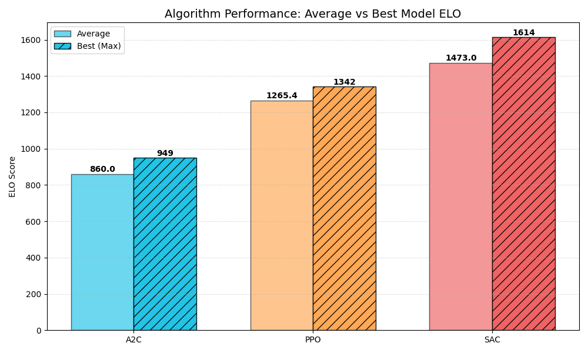
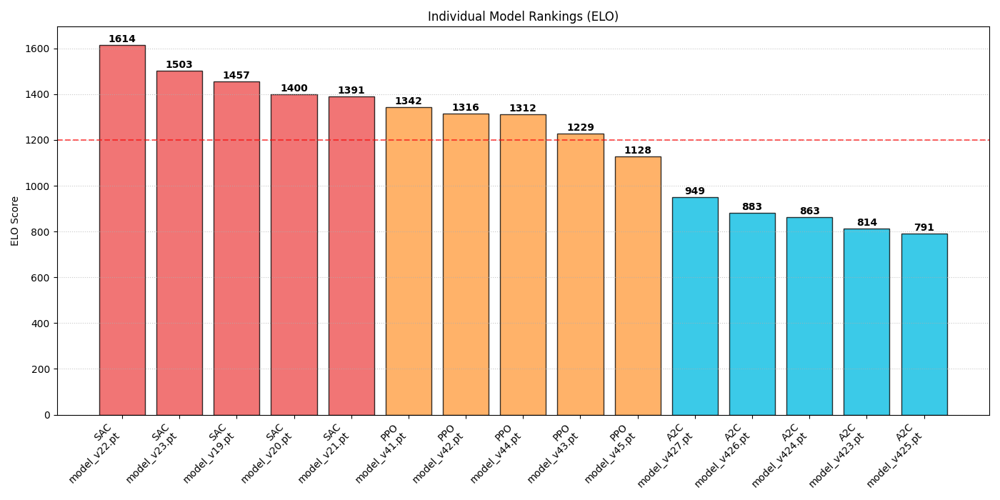
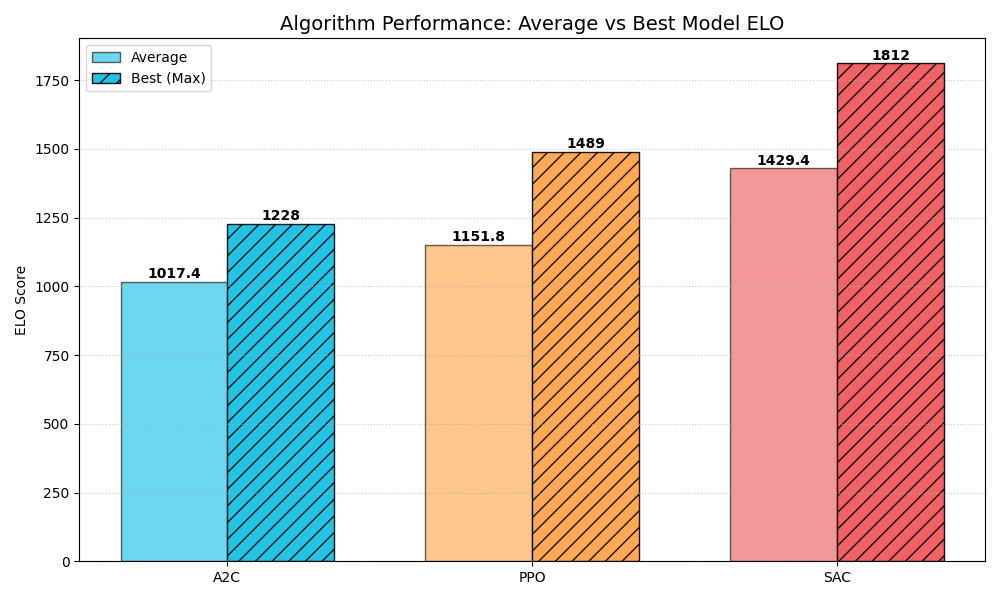
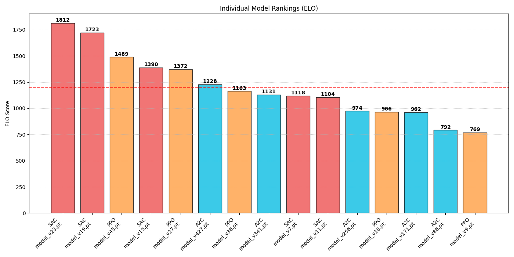

# RobotSumo RL Training System

This project implements an autonomous RobotSumo combat agent trained using Reinforcement Learning (Actor-Critic architecture). The system utilizes a specialized training environment featuring a **self-play mechanism**, where the learning agent competes against a "Master" model or its own historical versions to continuously evolve and refine its combat strategies. 

Key features include a sophisticated **reward shaping engine** designed to promote aggressive forward movement, precise aiming, and strategic ring positioning while penalizing passive behaviors like spinning or backward driving.

### *Real-time combat demonstration with live reward tracking.*

https://github.com/user-attachments/assets/ca0baaf4-f6bf-412e-9ca7-3786b3346c5d
<p align="center">
  <em>SAC agent (Green) vs A2C agent (Blue)</em>
</p>

https://github.com/user-attachments/assets/2b496931-9eda-4c8b-88ca-7286d5fa9b42
<p align="center">
  <em>SAC agent (Green) vs PPO agent (Blue)</em>
</p>

https://github.com/user-attachments/assets/bdabd7a4-4890-47b2-a4cf-d7549b31da2e
<p align="center">
  <em>A2C agent (Green) vs PPO agent (Blue)</em>
</p>


## System Architecture

The following block diagram illustrates the closed-loop control system. It distinguishes between the **Mobile Robot** (physical/sensing layer) and the **RL Controller** (decision layer). Note that the goal signal $\mathbf{r}_t$ is only utilized during the training phase to shape the policy via the reward engine.

<div align="center">
  
</div>

### Functional Blocks

* **Controller (RL Policy):** A neural network-based agent (e.g., SAC, PPO, or A2C) that maps the current observation vector to a continuous action space. It operates as the inference engine during the deployment phase.
* **Dynamics:** Represents the second-order physical model of the robot. It calculates the response to input forces and torques, accounting for mass, moment of inertia, and friction, influenced by external **Disturbances** (SAT Collisions).
* **Kinematics:** A state integration block that transforms generalized velocities into global coordinates. It maintains the robot's pose relative to the arena's origin.
* **Perception (Sensor Fusion):** A preprocessing layer that transforms raw global state data and environment information (e.g., opponent position) into a normalized, egocentric observation vector.

### Signal Vectors

The communication between blocks is defined by the following mathematical vectors:

* $\mathbf{r}_t$: **Reward/Goal signal** – utilized exclusively during training to guide the policy optimization via the reward shaping function.
* $\mathbf{a}_t = [v\_{target}, \omega\_{target}]^T$: **Action vector** – control commands representing desired linear and angular velocities.
* $\dot{\mathbf{x}}_t = [\dot{x}, \dot{y}, \dot{\theta}]^T$: **State derivative** – the instantaneous generalized velocities calculated by the dynamics engine.
* $\mathbf{y}_t = [x, y, \theta]^T$: **Physical output (Pose)** – the current coordinates and orientation of the robot in the global frame.
* $\mathbf{s}_t$: **Observation vector (`state_vec`)** – an 11-dimensional normalized feature vector containing proprioceptive cues (velocity) and exteroceptive spatial relations (distance to opponent/edges).

## State Vector Specification
The input state vector (`state_vec`) consists of 11 normalized values, providing the agent with a comprehensive view of the situation on the arena:

| Index | Parameter | Description | Range | Source / Sensor |
| :--- | :--- | :--- | :--- | :--- |
| 0 | `v_linear` | Robot's linear velocity (forward/backward) | [-1.0, 1.0] | Wheel Encoders / IMU Fusion |
| 1 | `v_side` | Robot's lateral velocity | [-1.0, 1.0] | IMU (Accelerometer) / State Estimation |
| 2 | `omega` | Rotational velocity | [-1.0, 1.0] | Wheel Encoders / Gyroscope (IMU) |
| 3 | `pos_x` | X position on the arena | [-1.0, 1.0] | Odometry / Localization Fusion |
| 4 | `pos_y` | Y position on the arena | [-1.0, 1.0] | Odometry / Localization Fusion |
| 5 | `dist_opp` | Normalized distance to the opponent | [0.0, 1.0] | Distance Sensors (IR/Ultrasonic) / LiDAR |
| 6 | `sin_to_opp` | Sine of the angle to the opponent | [-1.0, 1.0] | Geometry (based on distance sensors) |
| 7 | `cos_to_opp` | Cosine of the angle to the opponent | [-1.0, 1.0] | Geometry (based on distance sensors) |
| 8 | `dist_edge` | Distance to the nearest arena edge | [0.0, 1.0] | Floor Sensors (Line detectors) / Geometry |
| 9 | `sin_to_center` | Direction relative to the arena center | [-1.0, 1.0] | Line sensors / State Estimation + Geometry |
| 10 | `cos_to_center` | Direction relative to the arena center | [-1.0, 1.0] | Line sensors / State Estimation + Geometry |


## Reward Shaping Details
The reward system is designed to enforce aggressive combat and strategic survival:

* **Terminal Rewards:** Large bonuses for winning and significant penalties for falling out or timing out (draw).   
* **Backward Block:** Reverse driving is strictly penalized and cancels other rewards for that step.
* **Anti-Spinning:** Penalties for excessive rotation to prevent aimless spinning.
* **Forward Progress:** Rewards for moving forward are scaled by targeting accuracy (facing the opponent).
* **Kinetic Engagement:** High-magnitude bonuses for maintaining forward velocity while directly facing the opponent, encouraging decisive attacks.
* **Edge Safety:** Proactive logic that penalizes movement toward the abyss and rewards returning to the arena center.
* **Combat Dynamics:** Rewards for high-velocity head-on collisions (pushing) and penalties for being hit from the side or rear.
* **Efficiency:** A constant time penalty per step to encourage the fastest possible victory.

## Environment Specification
The simulation environment is built to reflect official RobotSumo competition standards with high physical fidelity:

* **Arena:** 
    * **(Dohyo):** Modeled with a standard radius (77 cm) and a defined center point. The environment strictly enforces boundary conditions; a match ends (Terminal State) as soon as any corner of a robot's chassis exceeds the `ARENA_DIAMETER_M`.     
* **Robot Physics:** 
    * **Chassis:** Robots adhere to the 10x10 cm square dimensions (`ROBOT_SIDE`).
    * **Dynamics:** The system implements mass-based acceleration, rotational inertia, and friction models (including lateral friction to simulate tire grip).
* **Collision System:** Real-time contact handling is powered by the **Separating Axis Theorem (SAT)**. It calculates non-elastic overlaps and applies physical impulses, affecting both forward and lateral velocities based on the robots' mass and restitution.
* **Start Conditions:** Features a standard starting distance (~70% of arena radius) with support for both fixed positions and randomized 360-degree orientations to enhance training robustness.


## Performance Analysis & Benchmarks

The tournament results clearly demonstrate the evolution of combat strategies and the efficiency of different Reinforcement Learning architectures. The comparison shows a clear hierarchy in both peak performance and the speed of convergence.

### Tournament Leaderboard & Efficiency

| Rank | Agent | Model Versions | ELO Rating | Episodes Required |
|:----:|:-----:|:--------------:|:----------:|:-----------------:|
| 1-5  | **SAC** | v19 - v23 | **1391 - 1614** | **~378** |
| 6-10 | **PPO** | v41 - v45 | **1128 - 1342** | **~1,049** |
| 11-15| **A2C** | v423 - v427| **791 - 949** | **10,000 - 24,604**|

> [!NOTE]
> **Note on Convergence Rate:** There is a massive disparity in sample efficiency across architectures. SAC reached its peak potential significantly earlier, requiring approximately **3x fewer episodes** than PPO and over **60x fewer** than A2C to converge to a proficient combat level.

### Top Models Comparison
*Comparison of the highest-performing versions (final iterations) for each architecture.*

<table width="100%">
  <tr>
    <td align="center">
      <br>
      <em>Peak ELO by algorithm</em>
    </td>
  </tr>
  <tr>
    <td align="center">
      <br>
      <em>Peak models</em>
    </td>
  </tr>
</table>

---

### Evolutionary Progress
*Analysis of model performance sampled at regular intervals across the entire learning process (5 stages per architecture).*

<table width="100%">
  <tr>
    <td align="center">
      <br>
      <em>Average ELO of sampled models by algorithm</em>
    </td>
  </tr>
  <tr>
    <td align="center">
      <br>
      <em>Sampled models</em>
    </td>
  </tr>
</table>

### Key Takeaways

* **SAC (Soft Actor-Critic) Efficiency:** SAC is the undisputed winner in this environment. Its off-policy maximum entropy framework allowed it to reach the highest skill ceiling (1614 ELO) with the best sample efficiency. 
    * *Behavioral Note:* SAC agents developed a sophisticated ability to recover their orientation when displaced and actively exploit even minor positioning mistakes made by the opponent.
* **PPO Stability & Tactics:** PPO remains a reliable contender, offering stable training and competitive performance. While it plateaus at a lower ELO than SAC, it remains a robust choice for continuous control.
    * *Behavioral Note:* Interestingly, PPO agents excelled in "clinch" situations, learning tactical maneuvers to unbalance the opponent during close-quarter contact to gain a positioning advantage.
* **A2C Performance Gap:** The basic Advantage Actor-Critic algorithm struggled significantly with sample efficiency and stability. Even with extensive training, its performance remained below the starting ELO of the more advanced architectures, highlighting the limitations of simpler on-policy methods in this task.
* **Architecture Evolution:** The project highlights that modern off-policy methods (SAC) are far better suited for **continuous, non-linear control tasks** than traditional on-policy methods. SAC's ability to maximize entropy while learning from off-policy data leads to more sophisticated, adaptive combat behaviors and a significantly higher performance ceiling.


## Simple Start

To run the simulation and see the agents in action, follow these steps:

### Installation
```bash
make install
```
### Quick Demo (Cross-Play, e.g. SAC vs PPO)
```bash
make cross-play
```

### Other commands
```bash
make train-sac        # Starts fresh SAC training (clears old models)
make train-ppo        # Starts fresh PPO training (clears old models)
make train-a2c        # Starts fresh A2C training (clears old models)
make test-sac         # Runs dedicated SAC test script
make test-ppo         # Runs dedicated PPO test script
make test-a2c         # Runs dedicated A2C test script
make tournament       # Auto-picks top 5 trained models & runs ELO ranking 
make clean-models     # Removes all training history and master models
```
*For a full list of available automation targets, please refer to the [Makefile](./Makefile).*


## Future Potential Improvements

* Observation Noise Injection: Implementing Gaussian noise models for lidar and odometry sensors to simulate real-world sensor stochasticity, facilitating better policy generalization and robustness.
* Expanding the input state vector with estimated opponent velocity based on recent lidar sensor samples.
* Implementing non-linear dynamics such as wheel slippage, linear-angular velocity saturation and motor saturation to better simulate real-world conditions.
* Create a script to analyze model decisions and create **statistics** (e.g., average steps, spin count, number of rear-end collisions).

## Citation

If this repository has helped you during your research, feel free to cite it:

**APA Style**
> Brzustowicz, S. (2026). RobotSumo-RL: Reinforcement Learning for sumo robots using SAC, PPO, A2C algorithms (Version 1.0.0) [Source code]. https://github.com/sebastianbrzustowicz/RobotSumo-RL

**BibTeX**
```bibtex
@software{brzustowicz_robotsumo_rl_2026,
  author = {Sebastian Brzustowicz},
  title = {RobotSumo-RL: Reinforcement Learning for sumo robots using SAC, PPO, A2C algorithms},
  url = {https://github.com/sebastianbrzustowicz/RobotSumo-RL},
  version = {1.0.0},
  year = {2026}
}
```
> [!TIP]
> You can also use the **"Cite this repository"** button in the sidebar to automatically copy these citations or download the raw metadata file.

## License

RobotSumo-RL Source-Available License (No AI Use).  
See the [LICENSE](./LICENSE) file for full terms and restrictions.

## Author

Sebastian Brzustowicz &lt;Se.Brzustowicz@gmail.com&gt;
